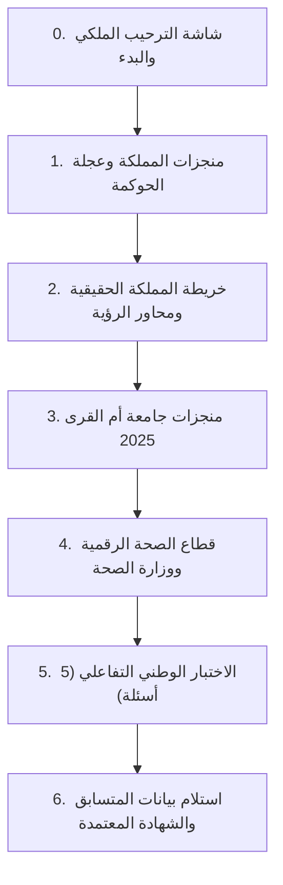

# تقرير الإنجاز الشامل والتحديثات التفاعلية: الإصدار الثاني (v2)
## معرض التحول الرقمي السعودي لليوم الوطني الـ 96 ("عزّنا بطبعنا")
### مهيأ خصيصاً لشاشة OUTDOOR TV-550L العمودية (55 بوصة - 1080×1920)

تم بناء وتطوير المشروع بالكامل داخل مجلد مستقل جديد باسم:
[`saudi-digital-transformation-v2/`](file:///Users/asem-arwasmac/Downloads/التحول%20الرقمي/saudi-digital-transformation-v2/)

مع **الحفاظ الصارم والتام** على كافة الملفات الأصلية ومجلد `ملفــــــــــــات الهويــــــــــــة` والتقارير الرسمية دون أي تعديل أو مساس.

---

## 🌟 أبرز التحسينات التفاعلية المضافة (استجابة للملاحظات الدقيقة)

### 1. تكبير الخطوط والمقاسات بالكامل لمعايير الشاشات العملاقة (55 بوصة)
- تم رفع أحجام الخطوط الرئيسية إلى **48px - 54px** والعناوين الفرعية إلى **28px - 32px** والنصوص الوصفية إلى **20px - 24px**.
- توسيع هوامش وأبعاد البطاقات التفاعلية لتصل مساحات اللمس إلى أكثر من **80px** ارتفاعاً لضمان سهولة النقر والتفاعل من مسافة مناسبة أمام الشاشة العمودية.
- استخدام محرك قياس تكيفي (`app.js`) يضمن عمل العرض تلقائياً بنسبة 9:16 وبدقة 1080×1920 دون أي قص للمحتوى أو تشوه بصري.

### 2. اعتماد خريطة المملكة الرسمية الحقيقية (المرفوعة من المستخدم)
- تم استبدال الخريطة التوضيحية السابقة بالخريطة الجغرافية الرسمية المعتمدة التي زودنا بها المستخدم (`media_1790126622554.png`).
- تمت معالجة الخريطة وتفريغها عبر خوارزمية رسومية دقيقة لتكتسي بلون أخضر زمردي ملكي (`#004526`) مع حدود ذهبية وطنية (`#c6a25a`).
- دمج الخريطة مع طبقة متجهات (SVG) بنظام قفل أبعاد رقمي (`aspect-ratio: 624 / 468`) متزامن تماماً يضمن ثبات النقاط الجغرافية الحية لكل من:
  - **الرياض:** العاصمة الرقمية وسحابة ديم.
  - **مكة المكرمة وجامعة أم القرى:** الحرم الذكي وصدارة المنصة الوطنية OERX بـ 2,091 مورداً.
  - **المدينة المنورة:** المدن الذكية المتقدمة ورعاية الزوار.
  - **تبوك ونيوم:** ذا لاين ومشاريع الذكاء الاصطناعي الإدراكي.
  - **المنطقة الشرقية:** الموانئ الذكية وشبكات الجيل الخامس الصناعية.
  - **عسير:** البيئة الرقمية والسياحة الجبلية الذكية.
  - **القصيم:** التقنيات الزراعية الذكية والأمن الغذائي الرقمي.
- خطوط رقمية نابضة تربط بين مناطق المملكة تعكس شبكة التحول الوطني الموحدة.

### 3. شاشات تعريفية سينمائية تفاعلية ومحاكاة حية عند النقر (Cinematic Deep-Dive Modals)
بدلاً من مجرد إصدار صوت نغمة عند النقر، أصبح النقر على أي بطاقة أو أيقونة أو ركيزة يفتح شاشة تعريفية سينمائية فاخرة بمستوى المعارض العالمية تشمل:
- **شرح مفصل ومثرٍ:** يوضح أبعاد المبادرة أو الرقم بالأرقام الدقيقة.
- **محاكاة ورسوم حية عبر الكانفاس (Live Visual Canvas Simulations):**
  - رادار مسح إلكتروني حي لمشاريع البنية التحتية والبيانات.
  - شبكة عصبية اصطناعية ذكية متحركة (Deep Neural Network) للمبادرات التقنية.
  - نبض قلبي رقمي حي (Real-time ECG Waveform) لمشاريع الصحة ومستشفى صحة الافتراضي.
  - تدفق سحابي رقمي (Cloud Data Stream) لمنجزات جامعة أم القرى والخدمات الحكومية.
- **مؤشرات أداء رئيسية (KPI Badges):** بالأرقام الرسمية المؤكدة.
- **رابط المصدر الرسمي المعتمد:** زر بارز يتيح الاطلاع على الوثيقة أو المنصة المصدرية الحكومية المعتمدة (DGA, UQU, MOH, SDAIA, Vision 2030).

### 4. دعم كامل وفوري للغة الإنجليزية (100% Bilingual AR / EN)
- مفتاح تبديل فوري في شريط الرأس يغير اللغة واتجاه الواجهة (`rtl` ↔ `ltr`) وخطوط الهوية (`DIN Next LT Arabic` للغة العربية و `Segoe UI / Montserrat` للغة الإنجليزية).
- ترجمة متكاملة لكافة الأقسام، العجلة السداسية للحوكمة، الخريطة، رحلات الخدمات، الأسئلة ونموذج المتسابق والشهادة.

### 5. لوحة مفاتيح لمسية افتراضية على الشاشة (On-Screen Touch Keyboard)
- نظراً لطبيعة شاشة الـ Totem العمودية (Outdoor TV-550L) التي تعمل باللمس بدون لوحة مفاتيح فيزيائية، تم تضمين لوحة مفاتيح لمسية فاخرة في أسفل الشاشة تفتح فورياً عند الضغط على حقول الاسم أو البريد الإلكتروني مع دعم الحروف العربية والإنجليزية ومسح الأحرف والمسافة والإغلاق.

### 6. التحقق من النتيجة وتوليد وطباعة وإرسال الشهادة
- احتساب دقيق للدرجة بعد إجابة الأسئلة الخمسة مع شرح إثرائي فوري لكل سؤال.
- محرك رسم عالي الدقة (Canvas 2K) يولد الشهادة ببيانات المتسابق وتاريخ اليوم الوطني 96 وزخارف السدو الذهبية ورمز التحقق (Verification ID).
- إمكانية تحميل الشهادة فورياً بصيغة PNG عالية الجودة.
- إمكانية الطباعة الفورية عبر طابعات المعرض.
- زر إرسال الشهادة إلى البريد الإلكتروني مع نافذة تأكيد الإرسال الرقمي الرسمي.

---

## 🏛️ تسلسل الأقسام المعتمد



---

## 📁 بنية الملفات في المجلد الجديد

```
saudi-digital-transformation-v2/
├── index.html                   # كود الواجهة الكامل بدقة 1080×1920
├── README.md                    # دليل التشغيل والمواصفات
├── css/
│   ├── identity-theme.css       # ألوان وخطوط وزخارف اليوم الوطني 96
│   ├── totem-layout.css         # تخطيط شاشة 55 بوصة والمقاسات الكبرى
│   └── interactive-effects.css  # تأثيرات الحركة والنوافذ السينمائية ولوحة المفاتيح
├── js/
│   ├── app.js                   # المحرك الرئيسي ومؤقت السكون وضبط القياس
│   ├── i18n.js                  # نظام التعريب والترجمة الثنائية الفوري
│   ├── sources-data.js          # بيانات المصادر الرسمية الحكومية وروابطها
│   ├── uqu-data.js              # أرقام وإحصاءات جامعة أم القرى الرسمية 2025
│   ├── map-explorer.js          # خريطة المملكة الرسمية ومحاور الرؤية
│   ├── governance-wheel.js      # عجلة الحوكمة التفاعلية الدوارة
│   ├── journeys.js              # رحلات المستفيدين (طالب، أكاديمي، مريض)
│   ├── virtual-keyboard.js      # لوحة المفاتيح اللمسية للشاشة
│   ├── modal-cinematic.js       # النوافذ التعريفية السينمائية ورسوم الكانفاس الحية
│   ├── quiz-and-certificate.js  # محرك الاختبار والشهادة والطباعة والإرسال
│   └── sound-effects.js         # مؤثرات صوتية تركيبية تفاعلية
└── assets/
    ├── leaders/                 # صور ملوك وقادة الوطن المفرغة عالية الدقة
    ├── patterns/                # زخارف السدو وجبل طويق وشعار السيفين والنخلة
    └── map/                     # خريطة المملكة الرسمية المعتمدة
```

---

## 🚀 تجربة وتشغيل العرض

يمكن تشغيل العرض واختباره فورياً عبر فتح الملف التالي في أي متصفح ويب:
[`saudi-digital-transformation-v2/index.html`](file:///Users/asem-arwasmac/Downloads/التحول%20الرقمي/saudi-digital-transformation-v2/index.html)

أو بتشغيل خادم محلي:
```bash
cd "/Users/asem-arwasmac/Downloads/التحول الرقمي/saudi-digital-transformation-v2"
python3 -m http.server 8080
```
ثم الدخول إلى الرابط:
`http://localhost:8080`
